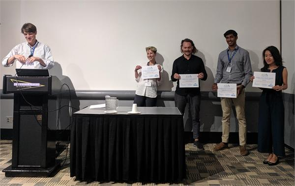

<a href="../index.html" class="btn">Home</a>
<a href="../about_us.html" class="btn">About Us</a>
<a href="../news.html" class="btn">News</a>
<a href="../jsm2021/index.html" class="btn">JSM 2021</a>
<a href="./index.html" class="btn">Competitions</a>
<a href="../join.html" class="btn">Join Us</a>

# Paper Competition Winners

## [JSM 2021 Student Paper Competition](https://astrostat.org/jsm2021/index.html)

- Finalists
  * **Alex Gagliano (UIUC)** *[GHOST: Using Only Host Galaxy Information to Accurately Associate and Distinguish Supernovae](https://ui.adsabs.harvard.edu/abs/2021ApJ...908..170G/abstract)*   Gagliano, A., Narayan, G., Engel, A., Carrasco Kind, M., LSST Dark Energy Science Collaboration, 2021, ApJ, 908, 170
  * **Karthik Reddy (UMaryland)** *[X-Ray-to-Radio Offset Inference from Low-Count X-Ray Jets](https://ui.adsabs.harvard.edu/abs/2021ApJS..253...37R/abstract)*   Reddy, K., Georganopoulos, M., &amp; Meyer, E.T., 2021, ApJS, 253, 37
  * **Lu Li (Shanghai Obs)** *[Modeling unresolved binaries of open clusters in the color-magnitude diagram](https://ui.adsabs.harvard.edu/abs/2020ApJ...901...49L/abstract)*   Li, L., Shao, Z., Li, Z.-Z., Yu, J., Zhong, J., &amp; Chen, L., 2020, ApJ, 901, 49
  * **Matt Nixon (Cambridge)** *[Assessment of Supervised Machine Learning for Atmospheric Retrieval of Exoplanets](https://ui.adsabs.harvard.edu/abs/2020MNRAS.496..269N/abstract)*   Nixon, M.C., &amp; Madhusudan, N., 2020, MNRAS, 496, 269
  * **Willow Fox-Fortino (UPenn)** *[Reducing ground-based astrometric errors with Gaia and Gaussian processes](https://ui.adsabs.harvard.edu/abs/2020arXiv201013742F/abstract)*   Fortino, W.F., et al., arXiv:2010.13742

## [JSM 2020 Student Paper Competition](https://astrostat.org/jsm2020/index.html#session-401)

See the [Session Program](https://ww2.amstat.org/meetings/jsm/2020/onlineprogram/ActivityDetails.cfm?SessionID=219559) for abstracts and schedule.

- Winner \\
**Josh Speagle** (Harvard) -- *[Photometric Biases in Modern Surveys](https://ui.adsabs.harvard.edu/abs/2020AJ....159..165P/abstract)*   Portillo, S.K.N., Speagle, J.S., &amp; Finkbeiner, D.P., 2020, AJ, 159, 165

- Finalists
  * **Richard Feder-Staehle** (Cal Tech) -- *[Multiband Probabilistic Cataloging: A Joint Fitting Approach to Point Source Detection and Deblending](https://ui.adsabs.harvard.edu/abs/2020AJ....159..163F/abstract)*   Feder, R.M., Portillo, S.K.N., Daylan, T., &amp; Finkbeiner, D., 2020, AJ, 159, 163
  * **Matthew Ho** (Carnegie Mellon) -- *[A Robust and Efficient Deep Learning Method for Dynamical Mass Measurements of Galaxy Clusters](https://ui.adsabs.harvard.edu/abs/2019ApJ...887...25H/abstract)*   Ho, M., Rau, M.M., Ntampaka, M., Farahi, A., Trac, H., &amp; Poczos, B., 2019, ApJ, 887, 25
  * **Oliver Philcox** (Princeton) -- *[Inferring Galactic Parameters from Chemical Abundances: A Multi-Star Approach](https://ui.adsabs.harvard.edu/abs/2019ApJ...887....9P/abstract)*   Philcox, O., &amp; Rybicki, J., 2019, ApJ, 887, 9
  * **Collin Politsch** (Carnegie Mellon) -- *[Trend Filtering: A Modern Statistical Tool for Time-Domain Astronomy and Astronomical Spectroscopy](https://ui.adsabs.harvard.edu/abs/2020MNRAS.492.4005P/abstract)*   Politsch, C., Cisewski-Kehe, J., Croft, R.A.C., &amp; Wasserman, L., 2020, MNRAS, 492, 4005

## JSM 2019 Student Paper Competition

The finalists await Prof. Chad Schafer to reveal the winner of the student paper competition at JSM 2019 in Denver, CO.

See the [Session Program](https://ww2.amstat.org/meetings/jsm/2019/onlineprogram/ActivityDetails.cfm?SessionID=218331) for abstracts and more information. 

- Winner -- Axel Widmark\\
Widmark, A., 2019, A&A, 623, A30, [Measuring the local matter density using Gaia DR2](https://www.aanda.org/articles/aa/pdf/2019/03/aa34718-18.pdf)

- Finalist -- Francesca Capel, KTH Royal Institute if Technology\\
Capel, F. & Mortlock, D.J., 2019, MNRAS, 484, 2324, [Impact of using the ultrahigh-energy cosmic ray arrival energies to constrain source associations](https://academic.oup.com/mnras/article-abstract/484/2/2324/5287987?redirectedFrom=PDF)

- Finalist -- Daniel Muthukrishna, University of Cambridge\\
Muthukrishna, D., Narayan, G., Mandel, K.S., Biswas, R., and Hlozek, R., 2019, arXiv: 1904.00014, [RAPID: Early Classification of Explosive Transients using Deep Learning](https://arxiv.org/pdf/1904.00014.pdf)

- Finalist -- Xixi Yu, Imperial College of Science & Technology\\
Yu, X., Del Zanna, G., Stenning, D.C., Cisewski-Kehe, J., Kashyap, V.L., Stein, N., van Dyk, D.A., Warren, H.P., and Weber, M.A., 2018, ApJ, 866, 146, [Incorporating Uncertainties in Atomic Data into the Analysis of Solar and Stellar Observations:A Case Study in FeXIII](https://iopscience.iop.org/article/10.3847/1538-4357/aadfdd/pdf)
