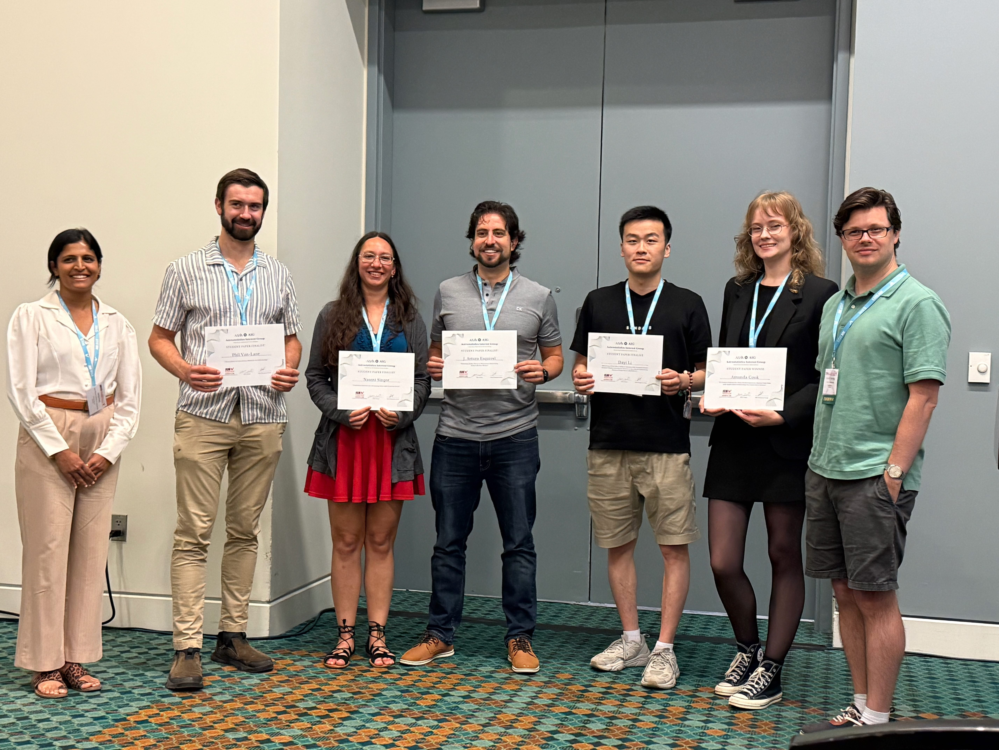
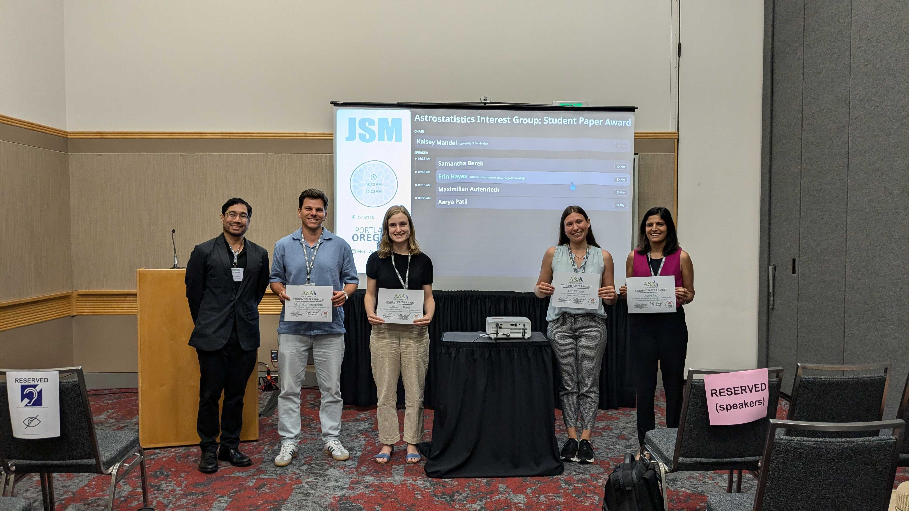
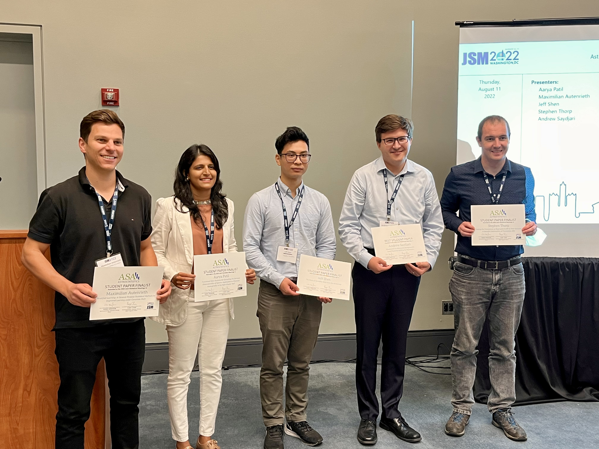

<a href="../index.html" class="btn">Home</a>
<a href="../about_us.html" class="btn">About Us</a>
<a href="../news.html" class="btn">News</a>
<a href="../jsm2021/index.html" class="btn">JSM 2021</a>
<a href="./index.html" class="btn">Competitions</a>
<a href="../join.html" class="btn">Join Us</a>

# Paper Competition Winners

## JSM 2025 Student Paper Competition

The student paper competition finalists at JSM 2025 in Nashville, TN

- Winner \\
**Amanda Cook (University of Toronto):** *[Quantifying the Clustering Probability in Noisy Nonhomogeneous Spatial Data to Identify New Repeating Fast Radio Burst Sources from CHIME/FRB](https://ui.adsabs.harvard.edu/abs/2024arXiv241012146C/abstract)*   Cook, A. M. et al., 2024, Annals of Applied Statistics, arXiv e-print

- Finalists
  * **J. Arturo Esquivel F. (University of Toronto)** *[A data-driven approach to stellar flare detection](https://ui.adsabs.harvard.edu/abs/2025ApJ...979..141E/abstract)*   Esquivel, J. A. et al., 2025, ApJ, 979, 2
  * **Phil Van-Lane (University of Toronto)** *[ChronoFlow: A Data-Driven Model for Gyrochronology](https://ui.adsabs.harvard.edu/abs/2025ApJ...986...59V/abstract)*   Van-Lane, P. R. et al., 2025, ApJ, 986, 1
  * **Dayi Li (University of Toronto)** *[Discovery of Two Ultra-Diffuse Galaxies with Unusually Bright Globular Cluster Luminosity Functions via a Mark-Dependently Thinned Point Process (MATHPOP)](https://ui.adsabs.harvard.edu/abs/2025ApJ...984..147L/abstract)*   Li, D. et al., 2025, ApJ, 984, 2
  * **Naomi Singer (North Carolina State University)** *[Prediction Intervals for Astronomy Data with Covariate Error](https://ui.adsabs.harvard.edu/abs/2025MNRAS.539.1372S/abstract)*   Singer, N. et al., 2025, MNRAS, 539, 2

## [JSM 2024 Student Paper Competition](https://astrostat.org/jsm2024/index.html)

The student paper competition finalists at JSM 2024 in Portland, OR

- Winner \\
**Maximillian Autenrieth (Imperial College London)** *[Improved Weak Lensing Photometric Redshift Calibration via StratLearn and Hierarchical Modeling](https://ui.adsabs.harvard.edu/abs/2024MNRAS.tmp.2186A/abstract)*   Autenrieth, M. et al., 2024, MNRAS, arXiv e-print

- Finalists
  * **Samantha Berek (Toronto)** *[The HERBAL Model: A Hierarchical Errors-in-variables Bayesian Lognormal Hurdle Model for Galactic Globular Cluster Populations](https://ui.adsabs.harvard.edu/abs/2023ApJ...955...22B/abstract)*   Berek, S. et al., 2023, ApJ, 955, 22
  * **Erin Hayes (Cambridge)** *[GAUSSN: Bayesian time-delay estimation for strongly lensed supernovae](https://ui.adsabs.harvard.edu/abs/2024MNRAS.530.3942H/abstract)*   Hayes, E. et al., 2024, MNRAS, 530, 3942
  * **Aarya Patil (Toronto / Max Planck)** *[Decoding the age-chemical structure of the Milky Way disc: an application of copulas and elicitable maps](https://ui.adsabs.harvard.edu/abs/2023MNRAS.526.1997P/abstract)*   Patil, A. et al., 2023, MNRAS, 526, 1997

## [JSM 2023 Student Paper Competition](https://astrostat.org/jsm2023/index.html)

- Winner \\
**Jacob Nibauer (Princeton)** *[Charting Galactic Accelerations with Stellar Streams and Machine Learning](https://ui.adsabs.harvard.edu/abs/2022ApJ...940...22N/abstract)*   Nibauer, J. et al., 2022, ApJ, 940, 1

- Finalists
  * **Martijn Oei (Leiden)** *[Measuring the giant radio galaxy length distribution with the LoTSS
](https://ui.adsabs.harvard.edu/abs/2023A%26A...672A.163O/abstract)*   Oei, M. S. S. L. et al., 2022, A&amp;A, 672, A163
  * **Dayi Li (Toronto)** *[Light from the Darkness: Detecting Ultra-diffuse Galaxies in the Perseus Cluster through Over-densities of Globular Clusters with a Log-Gaussian Cox Process](https://ui.adsabs.harvard.edu/abs/2022ApJ...935....3L/abstract)*   Li, D. D. et al., 2022, ApJ, 935, 3L
  * **Sam Ward (Cambridge)** *[Relative Intrinsic Scatter in Hierarchical Type Ia Supernova Sibling Analyses: Application to SNe 2021hpr, 1997bq, and 2008fv in NGC 3147
](https://ui.adsabs.harvard.edu/abs/2023ApJ...956..111W/abstract)*   Ward, S. M. et al., 2023, ApJ, 956, 2

## [JSM 2022 Student Paper Competition](https://astrostat.org/jsm2022/index.html)

The student paper competition finalists at JSM 2022 in Washington, D.C.

- Winner \\
**Andrew Kahlil Saydjari (Harvard)** *[Photometry on Structured Backgrounds: Local Pixelwise Infilling by Regression](https://ui.adsabs.harvard.edu/abs/2022ApJ...933..155S/abstract)*   Saydjari, A. K. &amp; Finkbeiner, D. P., 2022, ApJ, 933, 155

- Finalists
  * **Aarya Anil Patil (Toronto)** *[Functional Data Analysis for Extracting the Intrinsic Dimensionality of Spectra: Application to Chemical Homogeneity in the Open Cluster M67](https://ui.adsabs.harvard.edu/abs/2022ApJ...926...51P/abstract)*   Patil, A. A., Bovy, J., Eadie, G., &amp; Jaimungal, S., 2022, ApJ, 926, 51
  * **Maximilian Autenrieth (ICL)** *[Supervised Learning and Hierarchical Bayesian Modeling Under Covariate Shift in Supernova Cosmology](https://ui.adsabs.harvard.edu/abs/2021arXiv210611211A/abstract)*   Autenrieth, M., van Dyk, D. A., Trotta, R., &amp; Stenning, D. C., 2021, arXiv e-print
  * **Jeff Shen (Toronto)** *[The Mass of the Milky Way from the H3 Survey](https://ui.adsabs.harvard.edu/abs/2022ApJ...925....1S/abstract)*   Shen, J., Eadie, G. M., Murray, N., Zaritsky, D., Speagle, J. S., Ting, Y.-S., Conroy, C., Cargile, P. A., Johnson, B. D., Naidu, R. P., &amp; Han, J. J., 2022, ApJ, 925, 1
  * **Stephen Thorp (Cambridge)** *[Testing the Consistency of Dust Laws in SN Ia Host Galaxies: A BayeSN Examination of Foundation DR1](https://ui.adsabs.harvard.edu/abs/2021MNRAS.508.4310T/abstract)*   Thorp, S., Mandel, K. S., Jones, D. O., Ward, S. M., &amp; Narayan, G., 2021, MNRAS, 508, 4310

We thank The Gordon & Betty Moore Foundation for financial support for the Finalists' travel to attend and present at JSM.

## [JSM 2021 Student Paper Competition](https://astrostat.org/jsm2021/index.html)

- Winner \\
**Alex Gagliano (UIUC)** *[GHOST: Using Only Host Galaxy Information to Accurately Associate and Distinguish Supernovae](https://ui.adsabs.harvard.edu/abs/2021ApJ...908..170G/abstract)*   Gagliano, A., Narayan, G., Engel, A., Carrasco Kind, M., LSST Dark Energy Science Collaboration, 2021, ApJ, 908, 170

- Finalists
  * **Karthik Reddy (UMaryland)** *[X-Ray-to-Radio Offset Inference from Low-Count X-Ray Jets](https://ui.adsabs.harvard.edu/abs/2021ApJS..253...37R/abstract)*   Reddy, K., Georganopoulos, M., &amp; Meyer, E.T., 2021, ApJS, 253, 37
  * **Lu Li (Shanghai Obs)** *[Modeling unresolved binaries of open clusters in the color-magnitude diagram](https://ui.adsabs.harvard.edu/abs/2020ApJ...901...49L/abstract)*   Li, L., Shao, Z., Li, Z.-Z., Yu, J., Zhong, J., &amp; Chen, L., 2020, ApJ, 901, 49
  * **Matt Nixon (Cambridge)** *[Assessment of Supervised Machine Learning for Atmospheric Retrieval of Exoplanets](https://ui.adsabs.harvard.edu/abs/2020MNRAS.496..269N/abstract)*   Nixon, M.C., &amp; Madhusudan, N., 2020, MNRAS, 496, 269
  * **Willow Fox-Fortino (UPenn)** *[Reducing ground-based astrometric errors with Gaia and Gaussian processes](https://ui.adsabs.harvard.edu/abs/2020arXiv201013742F/abstract)*   Fortino, W.F., et al., arXiv:2010.13742

## [JSM 2020 Student Paper Competition](https://astrostat.org/jsm2020/index.html#session-401)

See the [Session Program](https://ww2.amstat.org/meetings/jsm/2020/onlineprogram/ActivityDetails.cfm?SessionID=219559) for abstracts and schedule.

- Winner \\
**Josh Speagle** (Harvard) -- *[Photometric Biases in Modern Surveys](https://ui.adsabs.harvard.edu/abs/2020AJ....159..165P/abstract)*   Portillo, S.K.N., Speagle, J.S., &amp; Finkbeiner, D.P., 2020, AJ, 159, 165

- Finalists
  * **Richard Feder-Staehle** (Cal Tech) -- *[Multiband Probabilistic Cataloging: A Joint Fitting Approach to Point Source Detection and Deblending](https://ui.adsabs.harvard.edu/abs/2020AJ....159..163F/abstract)*   Feder, R.M., Portillo, S.K.N., Daylan, T., &amp; Finkbeiner, D., 2020, AJ, 159, 163
  * **Matthew Ho** (Carnegie Mellon) -- *[A Robust and Efficient Deep Learning Method for Dynamical Mass Measurements of Galaxy Clusters](https://ui.adsabs.harvard.edu/abs/2019ApJ...887...25H/abstract)*   Ho, M., Rau, M.M., Ntampaka, M., Farahi, A., Trac, H., &amp; Poczos, B., 2019, ApJ, 887, 25
  * **Oliver Philcox** (Princeton) -- *[Inferring Galactic Parameters from Chemical Abundances: A Multi-Star Approach](https://ui.adsabs.harvard.edu/abs/2019ApJ...887....9P/abstract)*   Philcox, O., &amp; Rybicki, J., 2019, ApJ, 887, 9
  * **Collin Politsch** (Carnegie Mellon) -- *[Trend Filtering: A Modern Statistical Tool for Time-Domain Astronomy and Astronomical Spectroscopy](https://ui.adsabs.harvard.edu/abs/2020MNRAS.492.4005P/abstract)*   Politsch, C., Cisewski-Kehe, J., Croft, R.A.C., &amp; Wasserman, L., 2020, MNRAS, 492, 4005

## JSM 2019 Student Paper Competition

The finalists await Prof. Chad Schafer to reveal the winner of the student paper competition at JSM 2019 in Denver, CO.

See the [Session Program](https://ww2.amstat.org/meetings/jsm/2019/onlineprogram/ActivityDetails.cfm?SessionID=218331) for abstracts and more information. 

- Winner -- Axel Widmark\\
Widmark, A., 2019, A&A, 623, A30, [Measuring the local matter density using Gaia DR2](https://www.aanda.org/articles/aa/pdf/2019/03/aa34718-18.pdf)

- Finalist -- Francesca Capel, KTH Royal Institute if Technology\\
Capel, F. & Mortlock, D.J., 2019, MNRAS, 484, 2324, [Impact of using the ultrahigh-energy cosmic ray arrival energies to constrain source associations](https://academic.oup.com/mnras/article-abstract/484/2/2324/5287987?redirectedFrom=PDF)

- Finalist -- Daniel Muthukrishna, University of Cambridge\\
Muthukrishna, D., Narayan, G., Mandel, K.S., Biswas, R., and Hlozek, R., 2019, arXiv: 1904.00014, [RAPID: Early Classification of Explosive Transients using Deep Learning](https://arxiv.org/pdf/1904.00014.pdf)

- Finalist -- Xixi Yu, Imperial College of Science & Technology\\
Yu, X., Del Zanna, G., Stenning, D.C., Cisewski-Kehe, J., Kashyap, V.L., Stein, N., van Dyk, D.A., Warren, H.P., and Weber, M.A., 2018, ApJ, 866, 146, [Incorporating Uncertainties in Atomic Data into the Analysis of Solar and Stellar Observations:A Case Study in FeXIII](https://iopscience.iop.org/article/10.3847/1538-4357/aadfdd/pdf)
