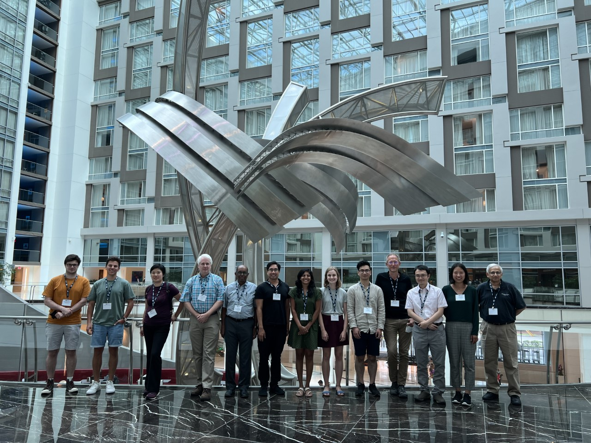

<a href="./about_us.html" class="btn">About Us</a>
<a href="./join.html" class="btn">Join AIG</a>
<a href="./competition/" class="btn">Competitions</a>
<a href="./news.html" class="btn">News</a>
<a href="./jsm2024/index.html" class="btn">JSM</a>
<a href="./ASAIP/index.html" class="btn">ASAIP</a>
<a href="https://www.amstat.org" class="btn">[ASA]</a>

Astrostatistics Interest Group at JSM 2022, Washington, DC 

Astrostatistics Interest Group at JSM 2018, Vancouver, BC 

---
# [Latest News](./news.html)

## Finalists of the 2024 Student Paper Competition
#### Oct 17, 2024
- **Samantha Berek (Toronto)** *The HERBAL Model: A Hierarchical Errors-in-variables Bayesian Lognormal Hurdle Model for Galactic Globular Cluster Populations*
- **Erin Hayes (Cambridge)** *GAUSSN: Bayesian time-delay estimation for strongly lensed supernovae*
- **WINNER: Maximillian Autenrieth (Imperial College London)** *Improved Weak Lensing Photometric Redshift Calibration via StratLearn and Hierarchical Modeling*
- **Aarya Patil(Toronto/Max Planck)** *Understanding the formation history of the Milky Way disk using Copulas and Elicitable Maps*

## JSM 2024
#### August 4, 2024
Three astrostatistics sessions will run during [JSM 2024](./jsm2024/index.html). If there are other items of interest to the AIG, please contact us to let us know.

## 2024 Student Paper Competition
#### Nov 9, 2023
### Application deadline: Tuesday, December 12, 2023 at 11:59 pm EST
The AIG is pleased to announce that the 2024 Student Paper Competition is now open for submissions! If you have submitted a paper either on or after December 6, 2022, related to the development and/or application of statistical methods to problems in astronomy, astrophysics, or cosmology, you may be eligible to enter! The winner and up to four additional finalists will receive cash prizes and present their work at JSM 2024 in Portland, Oregon, USA. Please see the <a href="./competition/">Competitions</a> page for additional details on eligibility and submission requirements. A collection of previous winners can be found [here](./competition/winners.html). **We strongly encourage students from groups underrepresented in statistics and/or astronomy to apply!**

**An information session was held online at 11:00 a.m. Eastern Time (US and Canada) on Nov 17, 2023. A recording of the session can be found [here](https://utoronto.zoom.us/rec/play/GRMoxjcnpJiChZx9-0VobNSjHSCeuuLsmzECI50_CWhhfv1tLgUeusZR9Mq9JM0I-mOVNmlApVrCatdP.7NRO38Q_NE1d5FYs?canPlayFromShare=true&from=my_recording&continueMode=true&componentName=rec-play&originRequestUrl=https%3A%2F%2Futoronto.zoom.us%2Frec%2Fshare%2FKXEbTK_jktrdGObmt56TO37iGBx3rMGS-rK5kSnwZSoF2ZHmC-RiZtwutiyISdf7.Xy_UtjanysY-Qx2-%3FstartTime%3D1700236537000%2520Passcode%3A%2520c5U%25KryQpC).**

## Finalists of the 2023 Student Paper Competition
#### Oct 30, 2023
- **Martijn Oei (Leiden)** *A geometric census of giants in the Local Universe: Bayesian inference of a sparse Paretian population*
- **WINNER: Jacob Nibauer (Princeton)** *Constraining Galactic Accelerations with Stellar Streams*
- **Dayi Li (Toronto)** *Detecting Ultra-Diffuse Galaxies through their Globular Clusters by Point Process Model*
- **Sam Ward (Cambridge)** *Hierarchically modelling NGC 3147’s trio of Type Ia supernova siblings: SNe 2021hpr, 1997bq and 2008fv*

## JSM 2023
#### August 7, 2023
Seven astrostatistics sessions will run during [JSM 2023](./jsm2023/index.html). If there are other items of interest to the AIG, please contact us to let us know.

## 2023 Student Paper Competition
### Submissions due by Monday, December 5, 2022 at 11:59pm EST
The AIG is pleased to announce that the 2023 Student Paper Competition is now open for submissions! If you have submitted a paper either on or after January 1, 2022 related to the development and/or application of statistical methods to problems in astronomy, astrophysics, or cosmology, you may be eligible to enter! The winner and up to four additional finalists will receive cash prizes and present their work at JSM 2023 in Toronto, Canada. Please see the <a href="./competition/">Competitions</a> page for additional details on eligibility and submission requirements.

## Finalists of the 2022 Student Paper Competition
#### August 7, 2022
- **Aarya Anil Patil (Toronto)** *Functional Data Analysis for Extracting the Intrinsic Dimensionality of Spectra: Application to Chemical Homogeneity in the Open Cluster M67*
- **Maximilian Autenrieth (ICL)** *Supervised Learning and Hierarchical Bayesian Modeling Under Covariate Shift in Supernova Cosmology*
- **Jeff Shen (Toronto)** *The Mass of the Milky Way from the H3 Survey*
- **Stephen Thorp (Cambridge)** *Testing the Consistency of Dust Laws in SN Ia Host Galaxies: A BayeSN Examination of Foundation DR1*
- **Andrew Kahlil Saydjari (Harvard)** *Photometry on Structured Backgrounds: Local Pixelwise Infilling by Regression*

## JSM 2022
#### August 7, 2022
Four astrostatistics sessions will be running during [JSM 2022](./jsm2022/index.html). If there are other items of interest to the AIG, please contact us to let us know.

## JSM 2021
#### Feb 6, 2021
Five astrostatistics sessions have been approved during [JSM 2021](./jsm2021/index.html).  If there are other items of interest to the AIG, please contact us to let us know.

## Finalists of the 2021 Student Paper Competition
#### Feb 2, 2021
- **Alex Gagliano (UIUC)** *GHOST: Using Only Host Galaxy Information to Accurately Associate and Distinguish Supernovae*
- **Karthik Reddy (UMaryland)** *X-Ray-to-Radio Offset Inference from Low-Count X-Ray Jets*
- **Lu Li (Shanghai Obs)** *Modeling unresolved binaries of open clusters in the color-magnitude diagram*
- **Matt Nixon (Cambridge)** *Assessment of Supervised Machine Learning for Atmospheric Retrieval of Exoplanets*
- **Willow Fox-Fortino (UPenn)** *Reducing ground-based astrometric errors with Gaia and Gaussian processes*

## AIG Office Bearers
#### Jan 1, 2021
New [office bearers](./about_us.html#officers) have been installed for the year 2021.

## AIG Business Meeting 2020
#### Aug 3, 2020
The Astrostatistics Interest Group held its annual business meeting via Zoom at 1pm on Aug 3 during the JSM.  For details, see the [JSM 2020 program](./jsm2020/index.html#aig-business-meeting).

---

# Interested in Astrostatistics?

1. [Join the ASA Astrostatistics Interest Group](./join.html)! Just make sure to provide your Name, Email, Affiliation, and ASA number. 
2. Explore the [Astrostatistics and Astroinformatics Portal](https://astrostat.org/ASAIP/index.html).
3. Start attending Astronomy seminars at your organization!

# Contact

- Email: aigamstat (at gmail)
- Slack: [AIG Slack channel](https://astrostatisti-dzq6013.slack.com/archives/C011GJMLLET)
